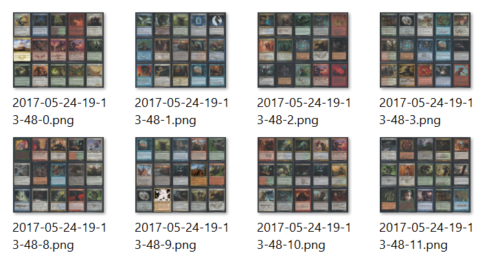
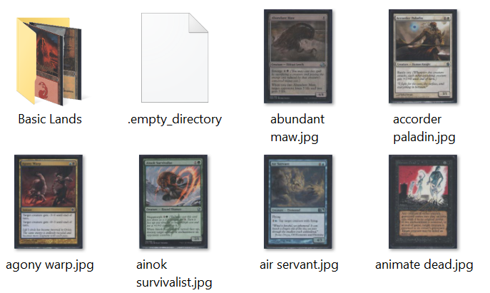

# MTG Cube Screenshots
After I scanned my entire cube I just wanted a simple way to generate sample packs for posting pick the picks.  



## Setup
All of the cube scans are in `/pictures`.  

  

*[generate-cardlist.js](generate-cardlist.js)* inspects the `pictures` directory and generates a list of files (excluding dotfiles) and writes to *[generated/cardlist.js](generated/cardlist.js)*. (`Pageres` doesn't seem to permit cross origin requests, so it's easier to just import a `js` file rather than making an ajax request for a json).  

The matching pattern is set to only look at the top level directory so I'm hiding my basic land scans in a subfolder, this could of course be changed depending on your organization.  

All of my scans are roughly `790x1080` for reference (with some variation), but scaled down and strictly sized in *[cube-pack.html](cube-pack.html)*.  

```sh
node generate-cardlist.js
```

## Tweaking
All the js/css is in *[cube-pack.html](cube-pack.html)*; tweak the image sizing and positioning based on your needs. The screenshot is defined in *[index.js](index.js)* so that would need to be updated to match.  

## Execution

```sh
node index.js <numberOfPacks>
```

Where `numberOfPacks` is an integer indicating the number of packs to generate; Defaults to 1.


## Comments
This is all super basic and hardcoded. Hopefully it proves useful as a reference to someone seeking something similar.  
There's also probably an argument for just generating the card list fresh each time. This sort of allows you to customize the generated list a bit more easily in case you have to add some remote images or whatever.
